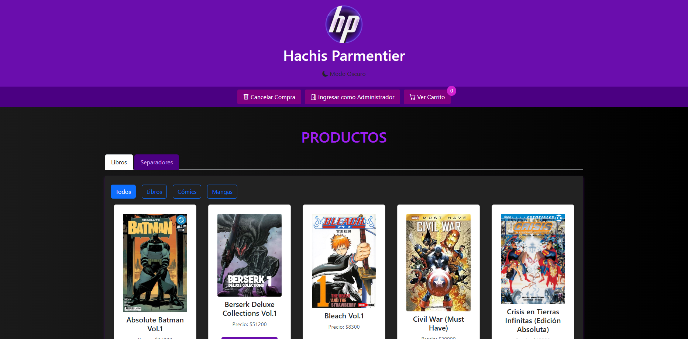
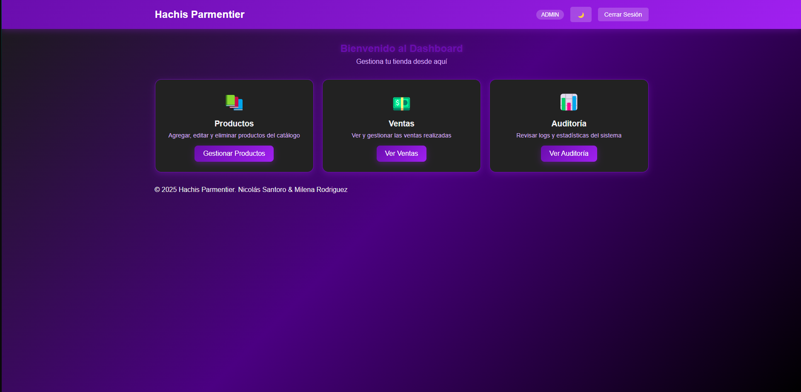

# Hachis Parmentier

---

¡Bienvenido a **Hachis Parmentier**! Este proyecto es un sistema de **autoservicio** para la compra de libros, cómics, mangas y separadores. A diferencia de un e-commerce tradicional, está diseñado para ofrecer una experiencia de compra fluida y autónoma.

El sistema se compone de dos interfaces principales: una para el cliente final y otra para la administración interna, ambas potenciadas por una API robusta que gestiona la base de datos de productos, ventas y usuarios.

## Funcionalidades

---

### Interfaz de Cliente

La interfaz de cliente está diseñada para ser intuitiva y fácil de usar, permitiendo a los usuarios:

* **Inicio:** Una página de bienvenida con información relevante.
* **Productos:** Explora un catálogo completo de libros, cómics, mangas y separadores.
* **Carrito:** Gestiona los artículos seleccionados antes de la compra.
* **Ticket:** Recibe un comprobante de la compra realizada.

### Interfaz de Administrador

El panel de administración ofrece control total sobre la operación del autoservicio, con las siguientes funciones:

* **Gestión de Productos:**
    * Agregar nuevos productos al catálogo.
    * Editar la información de productos existentes.
    * Eliminar productos del inventario.
    * Reactivar productos previamente eliminados.
* **Visualización de Ventas:** Accede a un registro detallado de todas las transacciones realizadas.
* **Historial de Cambios:** Un log completo que muestra qué cambios se han realizado en el sistema y por qué rol de usuario (administrador) fueron ejecutados.

## Tecnologías Utilizadas

---

Este proyecto ha sido construido utilizando un conjunto de tecnologías modernas para asegurar su eficiencia y escalabilidad:

* **Node.js:** Entorno de ejecución para el backend.
* **Express.js:** Framework web para construir la API RESTful.
* **MongoDB:** Base de datos NoSQL para almacenar la información de productos, ventas y usuarios.
* **jsonwebtoken:** Para la autenticación y autorización de usuarios.
* **Supabase:** Para la gestión de usuarios y autenticación.

## Estructura del Proyecto

---

Hachis Parmentier se basa en una arquitectura cliente-servidor con una API central. La API es el corazón del sistema, conectando la interfaz de usuario con la base de datos que alberga toda la información crucial, desde el inventario de productos hasta los registros de ventas y los datos de usuario.

## Instrucciones de Instalación

---

Sigue estos pasos para levantar el proyecto en tu entorno local:

1.  **Clonar el repositorio:**
    ```bash
    git clone [https://github.com/MilenaRodriguezzz/hachis-parmentier-website]
    ```
2.  **Instalar dependencias del backend:**
    ```bash
    npm install
    ```
3.  **Ejecutar el proyecto:**
    ```bash
    npm run dev
    ```

## Vistas del Proyecto

---

Aquí puedes ver algunas capturas de pantalla de **Hachis Parmentier** en acción:

### Página de Productos



---

### Dashboard de Administración



---

### Página de Edición de Productos


---

## Autores

---

Este proyecto ha sido desarrollado por:

* **Milena Rodríguez**
* **Nicolás Santoro**